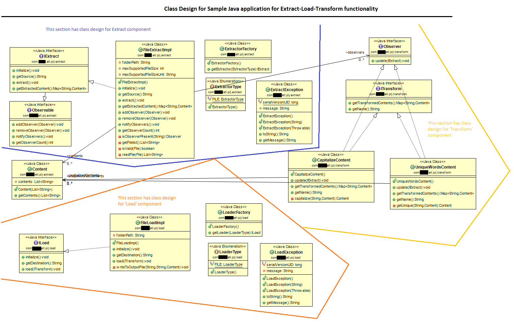

# Что такое паттерн проектирования?

**Паттерн проектирования** — это часто встречающееся решение определённой проблемы (шаблонизированный подход к решению проблемы) при проектировании архитектуры программ.

Самые низкоуровневые и простые паттерны — *идиомы*. Они не универсальны, поскольку применимы только в рамках одного языка программирования. Например, в С++ применение идиомы RAII:
```c++
std::string GetFirstLineOf(const char* filename) {
    // Stack allocated
    OpenFile file(filename);
    return file.ReadLine();
    // File closed here, it goes out of scope and destructor is run.
}
```
или list/dict/set/generator comprehensions в Python:
```python
>>> [2**x for x in range(10)]
    # [1, 2, 4, 8, 16, 32, 64, 128, 256, 512]
>>> {x%2 for x in range(10)}
    # {0, 1}
>>> {x: x>4 for x in range(10)}
    # {0: False, ..., 4: False, 5: True, ..., 10: True}
>>> (2**x for x in range(10))
    # <generator object <genexpr> at 0x7fe8f7e6f740>
```

Самые универсальные — архитектурные паттерны, которые можно реализовать практически на любом языке. Они нужны для проектирования всей программы, а не отдельных её элементов.
Кроме того, паттерны отличаются и предназначением. Есть три основные группы паттернов:
  * **Порождающие**: беспокоятся о гибком создании объектов без внесения в программу лишних зависимостей, Ctrl+C & Ctrl+V Driven Development и прочих "радостей" разработки.
  * **Структурные**: показывают различные способы построения связей между объектами.
  * **Поведенческие**: заботятся об эффективной коммуникации между объектами и их поведении (извините за тавтологию).

Важно понимать, что паттерны это не готовые функций или библиотек, паттерн нельзя просто взять и скопировать в программу. Паттерн представляет собой не какой-то конкретный код, а общую концепцию решения той или иной проблемы, которую нужно будет ещё подстроить под нужды вашей программы.
Также не стоит путать паттерны с алгоритмами, ведь оба понятия описывают типовые решения каких-то известных проблем. Но если алгоритм — это чёткий набор действий, то паттерн — это высокоуровневое описание решения, реализация которого может отличаться почти наверное.
Житейская аналогия: алгоритм — это кулинарный рецепт с чёткими шагами, а паттерн — инженерный чертёж, на котором нарисовано решение, но не конкретные шаги его реализации.


Описания паттернов обычно очень формальны и чаще всего состоят из таких пунктов:
  * имя паттерна
  * задача, которую должен решить паттерн
  * решение, которое предполагает подход (читай дословно "паттерн")
  * результат применения данного подхода (например, количество классов в иерархии наследования станет не N * M, а N + M)

---

# UML нотация (диаграммы классов)

**UML** (**U**nified **M**odelling **L**anguage, рус. "унифицированный язык моделирования") - стандарт при описании объектно-ориентированных систем.




